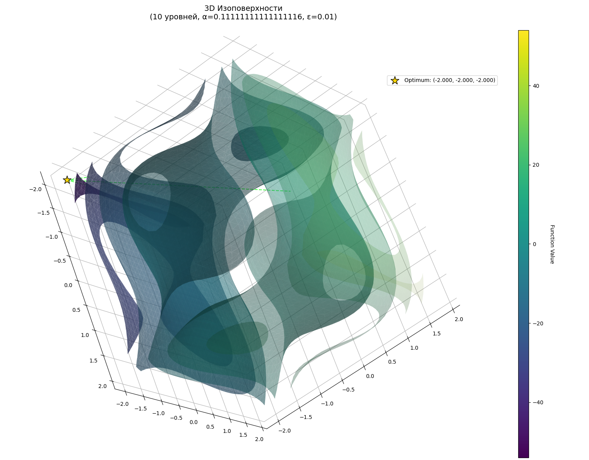
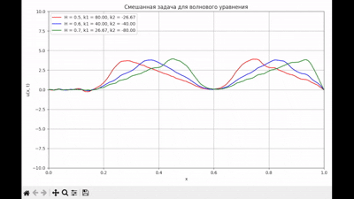
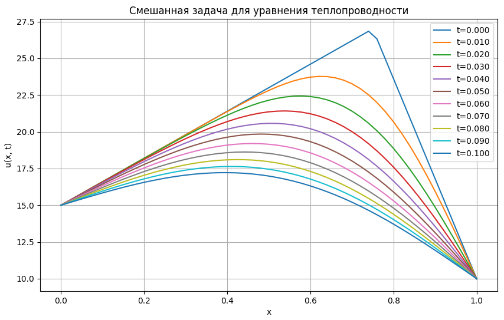
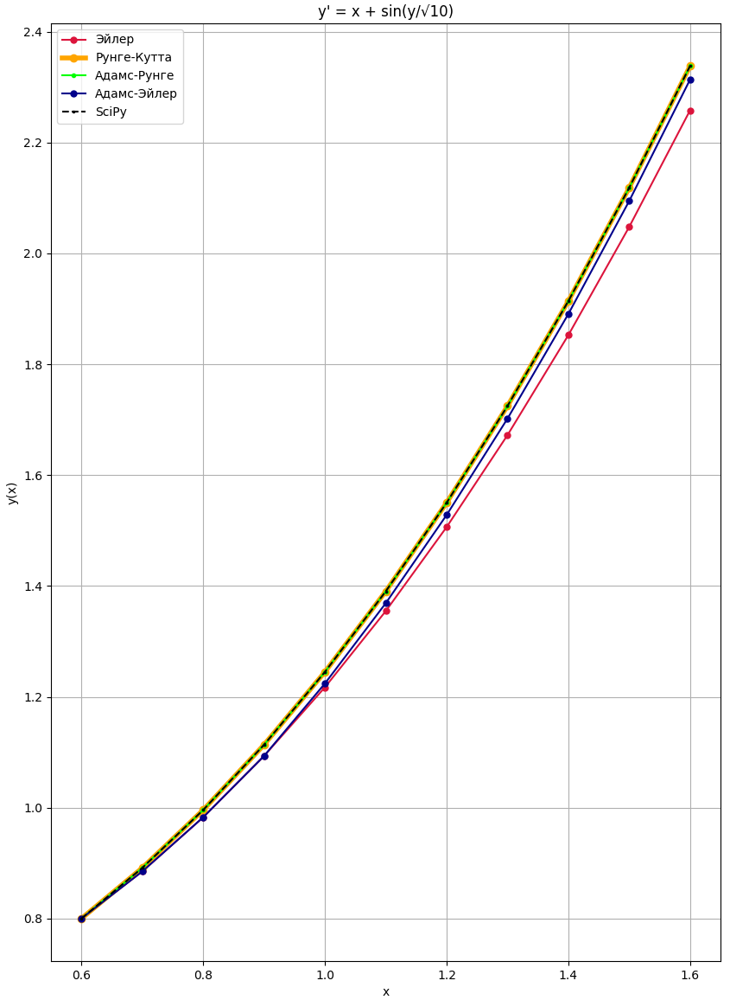
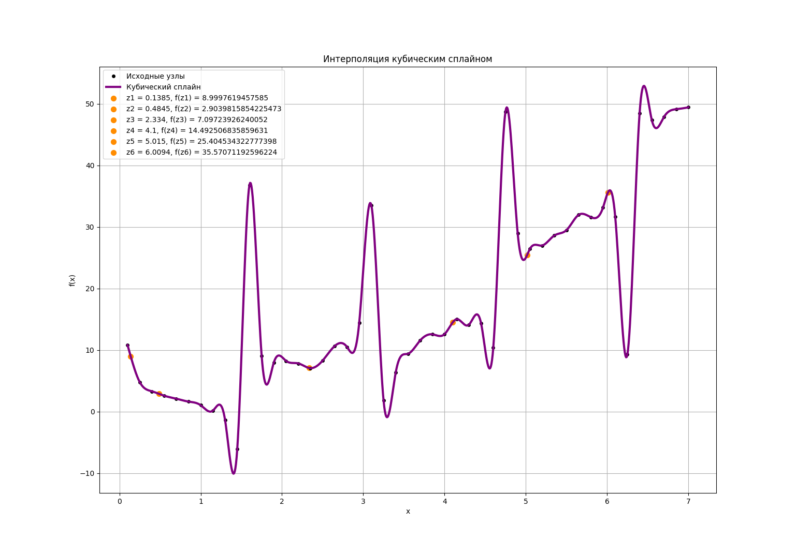
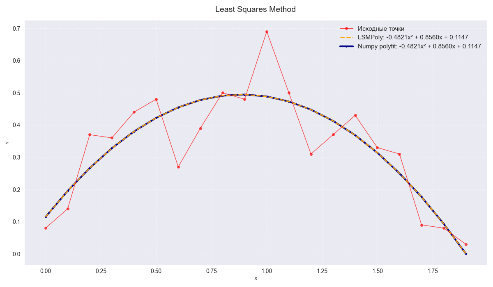
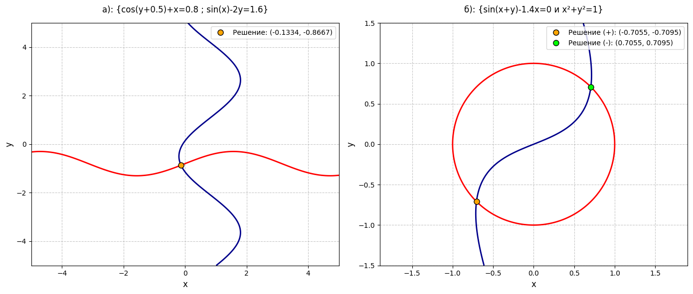

# Numerical Methods & Optimization Library

Python implementation of numerical methods and optimization algorithms.

## Languages

- [English](README.md)
- [Русский](README_RU.md)

## Results

### Optimization Methods

<div align="center">
  
  <br>
  <em>Isosurface visualization in multidimensional space for generalized blind search algorithm</em>
</div>

<div align="center">
  
  <br>
  <em>Convergence to global optimum from local minimum on anisotropic function</em>
</div>

### Partial Differential Equations

<div align="center">
  
  <br>
  <em>Wave equation solution animation using finite difference method</em>
</div>

<div align="center">
  
  <br>
  <em>1D parabolic equation solution (mixed boundary problem)</em>
</div>

<div align="center">
  
  <br>
  <em>Comparison of differential equation solving methods</em>
</div>

### Interpolation & Approximation

<div align="center">
  
  <br>
  <em>Data interpolation using cubic splines</em>
</div>

<div align="center">
  
  <br>
  <em>Data approximation with discrete least squares method</em>
</div>

### Nonlinear Equations Systems

<div align="center">
  
  <br>
  <em>Nonlinear system solution using Newton's method</em>
</div>

## Project Structure

### Modeling

- Diffusion and transport equation solvers (Roberts, Gaussian model, Euler, UpWind)
- Explicit and implicit schemes for PDEs
- Crank-Nicolson method for semi-empirical equations

### Numerical Methods

- **Approximation**: LSM (discrete and integral)
- **ODEs/PDEs**: Cauchy problems, boundary problems (Thomas algorithm), hyperbolic and parabolic equations, Dirichlet problem for Laplace equation
- **Differentiation**: Runge 2nd order method
- **Nonlinear equations**: Newton, simple iteration, dichotomy
- **Nonlinear systems**: Newton, simple iteration
- **Interpolation**: Lagrange (equidistant/non-equidistant nodes), Newton, cubic splines
- **Integration**: rectangles, trapezoids, Simpson

### Optimization

- **Extremum search**: bisection, Fibonacci, golden section, quadratic/cubic interpolation, scanning
- **Multidimensional optimization**:
  - Gradient method
  - Conjugate gradients
  - Gauss-Seidel
  - Rosenbrock method
  - Pairwise probe (classical, stochastic)
  - Custom pairwise probe with direction batching
  - Random directions
  - Blind search
  - Random penalty search

## Features

- Generalized algorithms for N-dimensional cases
- My modification of pairwise probe: batching N samples with best direction selection
- Algorithms with usage examples + visualization
- 40+ implemented methods
- Pure Python + NumPy/SciPy + Matplotlib

## Usage

```bash
pip install -r requirements.txt
```
